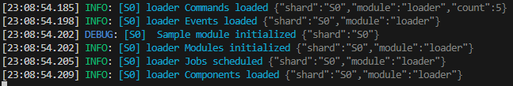

# Discord Bot Template (TypeScript • discord.js • tsup • pino)

Modern, modular, and fast. Batteries included: commands, events, components, jobs, modules, cooldowns, structured logs, optional metrics, i18n, and pluggable persistence (memory/SQLite/Redis). Works unsharded or sharded.

<p align="center">
  
</p>

---

## Badges


---

## Table of Contents

- [Features](#features)
- [Architecture](#architecture)
- [Requirements](#requirements)
- [Quick Start](#quick-start)
- [Configuration](#configuration)
- [Bot Setup (Portal, Scopes, Permissions, Intents)](#bot-setup-portal-scopes-permissions-intents)
- [Scripts](#scripts)
- [Scaffolding (Create Features Fast)](#scaffolding-create-features-fast)
- [Logging](#logging)
- [Metrics](#metrics)
- [Persistence](#persistence)
- [i18n](#i18n)
- [Sharding](#sharding)
- [CI](#ci)
- [Troubleshooting](#troubleshooting)
- [Contributing](#contributing)
- [License](#license)

---

## Features

- Modular loaders for commands, events, components, jobs, modules
- Slash + Context Menu commands with cooldowns and per-command guards
- Component router for buttons, selects, modals with safe fallbacks
- Structured logging via pino with shard labels and pretty dev output
- Optional Prometheus metrics at `/metrics`
- Pluggable store: memory, SQLite, or Redis
- Basic i18n with per-guild locale and a minimal `t()` helper
- Sharding-ready with unified dev/prod entry
- DX niceties: ESM, fast builds with tsup, `.editorconfig`, `.nvmrc`, and copy-ready templates

<p align="center">
  
</p>

---

## Architecture

```

src/
commands/           slash + context menu commands
components/         button/select/modal handlers (idPrefix-based routing)
core/               logger, env, loader, metrics, store
deploy/             command registration script
events/             discord.js events
i18n/               translation bundles and helper
jobs/               long-running tasks or schedulers
modules/            feature initializers
utils/              helpers (shard label, respond)
index.ts            app entry (single process)
shard.ts            sharded entry

````

The loader scans folders and auto-registers. Guards check owner/user/bot perms and cooldowns before execution.

---

## Requirements

- Node 20.x
- Discord application with a Bot Token

### Recommended Node setup

Windows (PowerShell):
```powershell
winget install Schniz.fnm
fnm env --use-on-cd | Out-String | Invoke-Expression
"fnm env --use-on-cd | Out-String | Invoke-Expression" | Add-Content $PROFILE
fnm install 20
fnm use 20
node -v
````

macOS/Linux:

```bash
curl -fsSL https://fnm.vercel.app/install | bash
fnm install 20
fnm use 20
node -v
```

---

## Quick Start

```bash
git clone https://github.com/WannaBeIan/DiscordBotTemplate
cd DiscordBotTemplate
npm i
cp .env.example .env
```

Set these in `.env`:

```
DISCORD_TOKEN=
DISCORD_CLIENT_ID=
DEFAULT_GUILD_ID=
```

Deploy and run:

```bash
npm run deploy:guild
npm run dev
```

Build and run:

```bash
npm run build
npm start
```

Sharded (optional):

```bash
npm run dev:sharded
npm run start:sharded
```

---

## Configuration

Copy `.env.example` → `.env` and fill:

```
DISCORD_TOKEN=
DISCORD_CLIENT_ID=
DEFAULT_GUILD_ID=
NODE_ENV=development
OWNER_IDS=
STORE_BACKEND=memory
SQLITE_PATH=./data/bot.db
REDIS_URL=
LOCALE_DEFAULT=en-US
METRICS_PORT=0
```

`STORE_BACKEND`: memory | sqlite | redis
`METRICS_PORT`: 0 disables; set a port to expose `/metrics`
`OWNER_IDS`: comma-separated IDs for owner-only commands

---

## Bot Setup (Portal, Scopes, Permissions, Intents)

Developer Portal

* Installation → Guild Install enabled
* Authorization Method: None
* Scopes: `bot` and `applications.commands`

Permissions integer

* Minimal: `2147568640`
* * Attach Files: `2147601408`
* * Reactions: `2147601472`

Gateway Intents

* Required: Guilds
* Common: Guild Members
* Optional: Message Content, Presence

Invite URL template:

```
https://discord.com/oauth2/authorize?client_id=YOUR_CLIENT_ID&scope=bot%20applications.commands&permissions=2147568640
```

<p align="center">
  
</p>

---

## Scripts

```json
{
  "build": "tsup",
  "dev": "tsx watch src/index.ts",
  "dev:sharded": "tsx src/shard.ts",
  "start": "node -e \"process.env.RUNTIME_DIR='dist'; import('./dist/index.js')\"",
  "start:sharded": "node -e \"process.env.RUNTIME_DIR='dist'; import('./dist/shard.js')\"",
  "deploy:global": "tsx src/deploy/deploy-commands.ts --global",
  "deploy:guild": "tsx src/deploy/deploy-commands.ts --guild"
}
```

---

## Scaffolding (Create Features Fast)

Duplicate templates and rename:

* `src/commands/templateCommand.ts`
* `src/components/templateComponent.ts` (`kind`: button | select | modal; `idPrefix` before the `:` in customId)
* `src/events/templateEvent.ts`
* `src/jobs/sampleJob.ts`
* `src/modules/sampleModule.ts`

After adding/removing commands:

```bash
npm run deploy:guild
```

---

## Logging

Dev: pretty, one-line, colored output with shard label `[S0]`.
Prod: JSON structured logs.

<p align="center">
  
</p>

---

## Metrics

Prometheus metrics at `/metrics` when `METRICS_PORT > 0`.

Counters and gauges:

* `bot_commands_total{name}`
* `bot_components_total{kind}`
* `bot_errors_total{type}`
* `bot_ws_ping_ms`
* `bot_guilds`
* `bot_users_cache`

Sharded behavior:

* Default: serve metrics only on shard 0
* Optional: per-shard mode with `basePort + shardId`

Run:

```bash
METRICS_PORT=3000 npm start
curl http://localhost:3000/metrics
```

---

## Persistence

Choose backend:

* `memory` for dev
* `sqlite` for a single-file DB at `SQLITE_PATH`
* `redis` for shared state across shards (`REDIS_URL`)

Guild locale is stored at `guild:<id>:locale`. Extend using the `KeyValueStore` interface.

---

## i18n

* Bundles in `src/i18n/i18n.ts`
* `t(key, locale, vars?)` resolves strings with `{var}` substitution
* `/locale` gets/sets per-guild locale

Add languages by extending the `bundles` object.

---

## Sharding

`src/shard.ts` spawns workers. Logs include shard labels from the first line.

<p align="center">
  
</p>

---

## CI

GitHub Actions included:

* `ci.yml` — build on push/PR
* `deploy-commands.yml` — manual command deploy with repo secrets

Set repo secrets:

* `DISCORD_TOKEN`
* `DISCORD_CLIENT_ID`
* `DEFAULT_GUILD_ID` (for guild deploy)

---

## Troubleshooting

**TokenInvalid**
Use the Bot Token, not Client Secret or Public Key.

**Integration requires code grant**
Disable “Require OAuth2 Code Grant” and ensure Installation settings match.

**This interaction failed**
Component not acked in time or unknown customId. The router safely handles unknown buttons/selects; rebuild if you changed routes.

**50001 Missing Access vs 50013 Missing Permissions**
50001: bot cannot view the channel.
50013: bot can view but lacks a specific permission.
Use channel sends to test real perms; interaction replies may bypass some checks.

**ERR\_MODULE\_NOT\_FOUND in prod**
Ensure code imports from `dist` in prod. `tsup` must include all entries.

**TS: Property 'commands' does not exist on Client**
Cast to `ExtendedClient` when accessing internal registries.

**TS: editReply type mismatch**
Strip `ephemeral/flags` when editing, or use the `safeReply` helper.

---

## Contributing

1. Fork and create a feature branch
2. Keep code minimal and optimized
3. Run:

```bash
npm ci
npm run build
npm run deploy:guild
npm run dev
```

4. Update README and `.env.example` for behavioral or env changes
5. Open a PR with clear testing steps

---

## License

MIT — see [LICENSE](https://github.com/WannaBeIan/DiscordBotTemplate/tree/main?tab=MIT-1-ov-file#readme).


 
